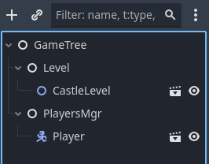
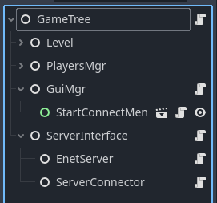
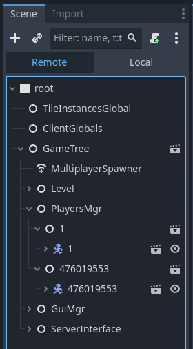
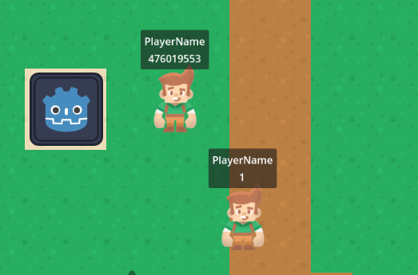
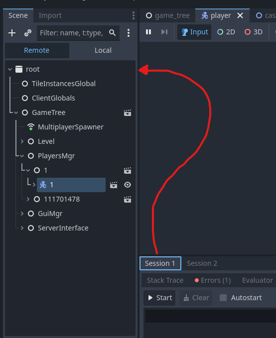
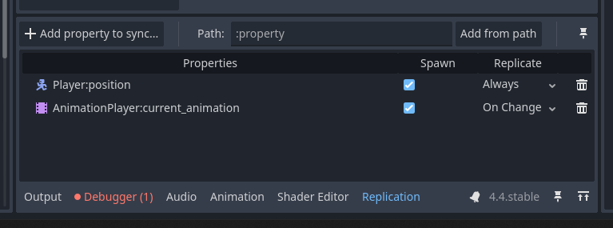
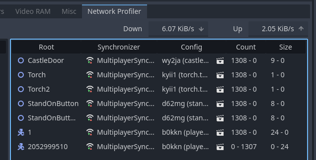

# Multiplayer Basics Workshop for GodotCon Boston 2025
We will start with a sample 2D top down game, and add multiplayer to it. If you get stuck, see the branch `finished-product`.

## Adding Multiplayer
We start with a player that can move around, but in order to get into the castle we need a friend to join our game and help us open the door.

We will set up a Host / Client network relationship. This means the host (the person running the server) is also playing the game. The computers that connect to the server are called clients. 
The host is essentially a client that is also responsible for owning the game state.

### 1. Set up our Game Tree
For single player games we usually have the player as a node inside of the level. For multiplayer, we want our game level to be seperate from the player, so that we can spawn multiple players.



### 1a. How to test locally?
In order to test multiplayer with only one computer, you can enable the setting for running multiple instances of your game. 
First, in the Game tab of the Godot Editor, **disable the "Embed Game on Next Play" setting**. 
In the Godot Editor, in the top left menu, go to Debug > Customize Run Instances. 
Check the box to enable multiple instances and set the number to 2 instances. When you run the game next, two windows of your game should pop up.

Note that this project has the [tile-instances](https://gist.github.com/mrcdk/3c22d91a3b4fb784d5df60667a33cf1e) addon installed, so the two windows should spawn side by side, helpful for rapid prototyping! 
Otherwise you'd have to move the windows around every time you run the game.

### 2. Connect the Computers over the Network
To connect from one computer to the other, we will set up a host & client relationship. Our host will create a ENet server and our client will connect to the host.
[ENet](http://enet.bespin.org/index.html) is a library that provides reliable UDP networking. Godot has [wrappers for the ENet library](https://docs.godotengine.org/en/stable/classes/class_enetconnection.html) in its high level multiplayer features.

[UDP](https://en.wikipedia.org/wiki/User_Datagram_Protocol) is a communication protocol, basically a way to send messages from one computer to the other.

We will create a Server Interface node that will be home to all the code related to hosting and connecting to the server. The Server Interface node will connect and manage the logic of it's child nodes.

Create a node named EnetServer. This node will have the logic for hosting a ENet Server.

Create a node named ServerConnector. This node will have the logic for connecting to a ENet Server.



When the host wants to start their server, through the EnetServer node they create a ENetMultiplayerPeer and call the `create_server(port, max_players)` function on it. They then store the newly created ENet peer in their `multiplayer` [MultiplayerAPI instance](https://docs.godotengine.org/en/latest/classes/class_multiplayerapi.html). 

⚠ NOTE: To allow clients to connect from other networks (not LAN) you will need to port forward the port you are hosting on.

When a client wants to join the server, through the ServerConnector node they also create a ENetMultiplayerPeer and call the peer's `create_client(host_ip, port)` function. Once the multiplayer peer's client is created, the client will start connecting to the host's ip and port. 

Also through the ServerConnector node, we will connect to signals coming from the MultiplayerAPI instance. We will listen for the `connection_failed` and `connected_to_server` signals, so we can respond when we fail or succeed in connecting.

For our first test, we will print out in the console to see when we start hosting, start joining, and have successfully connected. The console output should look like this:
```
Server started on port: 25026
Connecting to server at address: localhost:25026
Connected to Server!
```

### 3. Spawn players for each client
Now that we know we can connect to each other, we want to be able to spawn a player for each person to play as.

We can use the `MultiplayerSpawner` node to spawn nodes in the scene tree, across all connected clients. 
Add a MultiplayerSpawner node to the GameTree. For the MultiplayerSpawner's spawn path, set it to spawn nodes under the PlayersMgr node.
We need to tell MultiplayerSpawner which scenes it is allowed to spawn.
Add the `entities/player.tscn` scene to the MultiplayerSpawner's auto spawn list. Also remove any players in the GameTree, as they will be spawned once connected to the server.

Right now, when we host or connect to the server, no players appear. We need to add some logic to our PlayersMgr.
Our PlayersMgr node will be responsible for spawning the player scenes. 
We listen for the `peer_connected` and `peer_disconnected` signals from the MultiplayerAPI instance. When a peer is connected, we instantiate our player scene as a child of PlayersMgr. 
The MultiplayerSpawner will see this new player scene was added, and will replicate it across to all the clients.

Additionally we will want to connect a signal from our EnetServer node, so that when we start hosting our server we can tell PlayersMgr to spawn a player for the host. 
As the host, when we join we will not receive a `peer_connected` signal since we are already connected to our computer that is hosting. 
Therefore we would be missing a player for the host to play as.

Every client who connects to the server will have a unique **peer_id**. 
When spawning the player characters, we want to make sure that each player node's name matches the peer_id, so we can keep track of what client is controlling which player.

When player nodes are spawned, I store them in a Dictionary, keyed by their peer_id. This way I can find any player's character using their peer_id, for updating variables like health or their appearance.
```
## Dictionary of player nodes, keyed by peer_id
var player_nodes: Dictionary = {}
```

🤔 At this point, if you host and connect to the server, you'll notice it almost works, but with some strange behaviors.
Trying to move the host's player will also move the client's player, and the positions of the players do not match on the host and the client.

We can fix this by [assigning multiplayer authority](https://docs.godotengine.org/en/stable/classes/class_node.html#class-node-method-set-multiplayer-authority) to the nodes that each client controls. 
This will allow us to ignore inputs if the node is not being controlled by the user who is providing inputs.
We can also ignore any physics_process calculations if we know that data will be calculated and syncronized over the network by another client.

### 3a. Assigning Multiplayer Authority
On each player character scene, we want to set the multiplayer authority as soon as they enter the tree.
```
func _enter_tree():
	# We set the name of the player's node as the peer_id when they connect,
	# so we can use it here to define who has control over this player.
	var peer_id: int = str(name).to_int()
	set_multiplayer_authority(peer_id)
```
You can either add this code directly to your player.tscn scene, or the way I prefer to do it is have player.tscn be a child of a MultiplayerClient scene. 
This way I can seperate the logic of setting multiplayer authority from the logic that drives my player.

This image below shows the Player's CharacterBody2D as a child of a MultiplayerClient node with the same peer_id name.



It is also helpful to have a label that displays the peer_id of each player in game.



In order to make sure the camera of the player that we own is the camera that is active, add the following code to PlayerController.gd. This function will call make_current on the camera that belongs to our player.
```
func _ready():
	if not is_multiplayer_authority(): return
	camera_2d.make_current()
```

🤔 When moving the host, we also are moving the connected client's player on the host's game. 
When moving the client, we don't seem to see the host's player. Where could the host's player be? (Answer: the host and the client are directly on top of each other).

This can be solved by filtering to only handle physics_process for whichever client has multiplayer authority over that player.
```
func _physics_process(_delta: float):
	if not is_multiplayer_authority(): return
	
	var direction: Vector2 = Input.get_vector("move_left", "move_right",
    "move_up", "move_down").normalized()
  ...
```

🔨 During debugging, to see what is happening on each client's scene tree, you can switch to the Remote tab of the Scene inspector. 
By default you will just see one of the client's remote scene tree, but if you have the Debugger panel open you can switch between the Sessions, so you can see what the other client's scene trees look like at runtime.



Now we can make sure we are only controlling the player we own!
But our connected peers seem to sit still. Let's start synchronizing their movement!

If you see this error: `on_spawn_receive: Condition "parent->has_node(name)" is true. Returning: ERR_INVALID_DATA`, you can ignore it.

### 4. Synchronizing Movement
To synchronize (AKA share, copy, replicate) variables across the network, we can use the [MultiplayerSynchronizer](https://docs.godotengine.org/en/stable/classes/class_multiplayersynchronizer.html) node.
In our player scene, add a MultiplayerSynchronizer node. You'll notice in the Godot Editor that a Replication tab has appeared on the bottom panel.
This Replication tab is where we define the object properties that we want to sync between all the clients.

Press the "+ Add property to sync" button and in the popup menu, select our Player's CharacterBody2D. You will be presented with all the properties of this node, for now just select position.
The "Player:position" property will be added to the Replication tab, and you will see that it Always replicate.

If you run the game now, you should see the positions of the players being synchronized across the network. Now your friend can help you open the castle door!



⚠ Note that in order for the Multiplayer Synchronizer to work, the node that it is syncing MUST have the same scene tree path on both clients! 
If you are syncing the movement of the host's character that is in the scene tree at: `root/GameTree/PlayersMgr/1/1`, then there must be a character on the other client's game at the same path!
This is why it is important to have an organized scene tree, and be cautious when adding or removing syncronized nodes at runtime.

### 5. Synchronize the Environment
Now you'll notice the host can happily enter the castle once both players step on the buttons. However the door remains closed on the client's game! 
We will need to sync the door being opened, as well as other things like player animations, the button animations, etc.
- Sync the `visible` property of the Torch's FlameSprite Sprite2D
- Sync the `current_animation` of the Player's AnimationPlayer
- Sync the `current_animation` of the StandOnButton's AnimationPlayer
- Sync the `is_open` variable of the Castle Door. In order to sync variables from scripts, you will have to add `@export` to export the variable before it is visible in the Replication tab.
- Sync the `position` and `rotation` of the Castle Door's StaticBody2D node.

The game will start to look more similar between the host and the client. 
Let's take a look at the Godot Editor's Network Profiler. In the bottom of the bottom panel of the Editor, press the Debugger tab. Then at the top of that panel, you should see Network Profiler.
Press the Start button on the Network Profiler and you will see how much data is being sent over the network.



The Down and Up indicators are showing how many Kibibytes (1024 bytes) per second you are sending to and from your client.
We want to keep these numbers as low as possible. 
Otherwise, our network could run out of bandwidth which would make player's games seem laggy and they could lose connection. 

To optimize for network bandwidth, consider Synchronizing variables less frequently, or only when they change.
For example our torch, buttons, and door variables do not get updated every frame, so let's set those variables to update only when they are changed.
To do this, go back to each relevant MultiplayerSynchronizer and change the property's replicate setting from Always to On Change.
Check how much this improves your bandwidth with the Network Profiler!

📈 If you want to really optimize for bandwidth, you can change the Replication Interval of the Synchronizer to be much lower, then lerp the variable as it is updated.
See my [NetPositionLerper in my FPS Deathmatch project](https://github.com/Travh98/fpsdeathmatch/tree/main/components/syncing_values).

### 6. Use Remote Procedure Calls (RPCs) to Share Data
You can do a lot with just MultiplayerSynchronizer, but if you want to send and receive more advanced data you can use RPC Functions.
RPC Functions (Remote Procedure Functions) are functions that you can run on other people's computers.
We will add multiplayer to the Chat UI system using RPC functions.

In our `ui/chat_ui.gd` script we have a function called `receive_message`, which takes in a string and adds it to the chat log.
We want to change the code so that when we call the `send_message` function, we are also remotely calling the `receive_message` function on our peer's computers.
This is how we can send larger and more complex data across the network.

In the `components/server_chat_rpc.gd` script I have the basics set up for a autoloaded script will hold our RPC functions related to chat.
When `ServerChatRpc.receive_message` is called, ServerChatRpc emits the `msg_received` signal to tell the ChatUI that a new message has come in.
You can see that `chat_ui.gd` is already connected to the ServerChatRpc autoload, in its `_ready()` function.

To make the `ServerChatRpc.receive_message` function able to be called remotely from other computers, we need to define the function as an RPC function.
Add `@rpc()` on the line above the function, and add the following settings: `"any_peer", "reliable", "call_local"`
```
## Call this function on the peer's computer to
## make them receive your message
@rpc("any_peer", "reliable", "call_local")
func receive_message(msg: String):
	msg_received.emit(msg)
	pass
```

`any_peer` means anyone can call it, not just the host.
`reliable` mean that this message will send until the receiver gets the message and says that they got it.
`call_local` means that this function will run on their computer and also on this computer too.

Now that we have enabled this function to be called remotely, lets change the `send_message` function from Chat UI to instead call `ServerChatRpc.receive_message` on every connected peer.
```
var msg: String = typing_msg_line_edit.text
ServerChatRpc.receive_message.rpc(msg)
```

You'll notice that instead of just calling `ServerChatRpc.receive_message(msg)`, we are calling the RPC of that function, and still pass in our `msg` as the function argument.
You should now be able to press T to type and Enter to send messages to every connected peer!

### 7. 🎉 Recap / Conclusion / Additional Resources
You now should be confident on how to:
- connect two or more computers over an internet connection with one person hosting a server
- spawn and synchronize characters for each player
- synchronize world level elements across each client
- use RPC functions to send any sort of data across the network

📚 Remember to use [Godot's High Level Multiplayer Documentation](https://docs.godotengine.org/en/stable/tutorials/networking/high_level_multiplayer.html) while learning!

📈 For another more advanced example of multiplayer in Godot, check out my [open source FPS Deathmatch](https://github.com/Travh98/fpsdeathmatch) project. 
There are a lot more features in this project like health, score, respawning, shooting, scoreboard, animations.

🎥 This [tutorial by DevLogLogan](https://youtu.be/n8D3vEx7NAE?si=lqVju8uJ8MCIOso-) helped me a lot when I was starting to learn multiplayer.

🎥 Here is a [goofy video](https://youtu.be/EdoysLI1X1Y?si=g80rq-J_5k1PAt1q) where I discover that sending too many messages will destroy your network bandwidth and make the game unplayable.

⌨ If you're interested in making a dedicated server, I have an open-source Dedicated Server Godot project ([Server repo](https://github.com/Travh98/SaW_Server), and [Client Repo](https://github.com/Travh98/SwordsAndWitchesMultiplayer)). Here's a [fun video](https://youtu.be/zszz2skKUz4?si=j3NZ9JNA5o1Lxto_) I made about it. The server is completely headless and is only responsible for syncronizing variables across to all the clients. It knows nothing about the map or world level, which is a big limitation. I prefer Host-Client relationships now where the multiplayer is all in one Godot project. This is cool to check out though if you're curious how it works.
